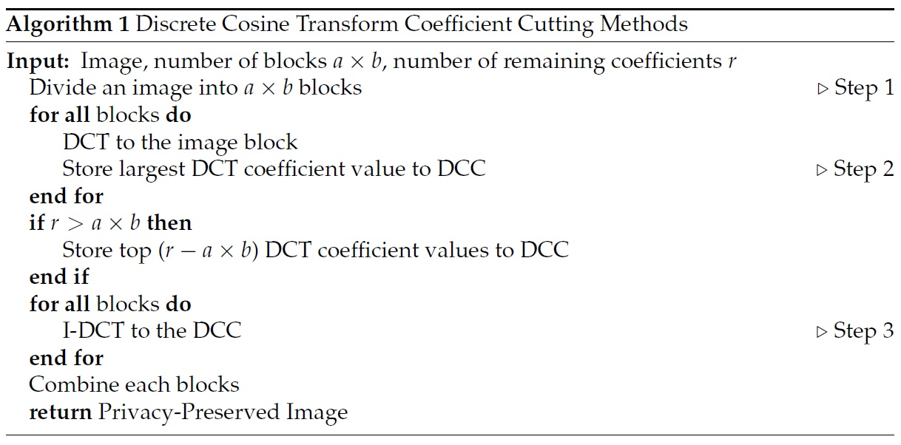

# Discrete Cosine Transform Coefficient Cutting Methods (DCC) 
Implementation of "Image Perturbation-Based Deep Learning for Face Recognition Utilizing Discrete Cosine Transform" by Jaehun Park and Kwangsu Kim

***Step 1 ((a)->(b)) Discrete Cosine Transform (DCT)***
>The original image is divided into several blocks, and each block is transformed from the spatial domain to the frequency domain by DCT and displayed as the DCT coefficient matrix.

***Step 2 ((b)->(c)) Coefficient Cutting (CUT)***
>The DCT coefficient matrix is filtered by coefficient cutting methods, such that only a few high-frequency coefficients in the DCC coefficient matrix remain.

***Step 3 ((c)->(d)) Inverse Discrete Cosine Transform (IDCT)***
>The DCC coefficient matrix is transformed from the frequency domain to the spatial domain by IDCT per block. 

To get DCC-transformed image, put the image into *sample.jpg* and run this code

    python sample.py
    
